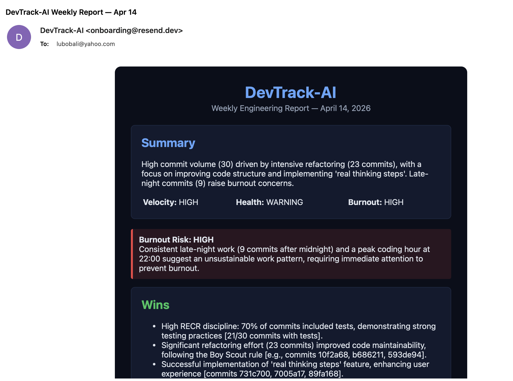
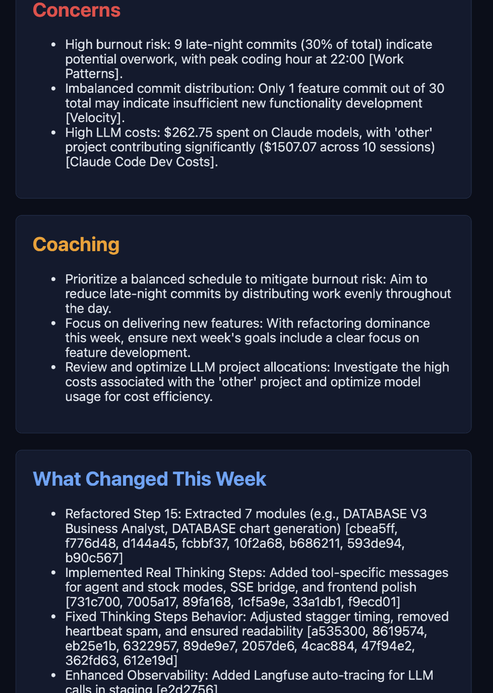
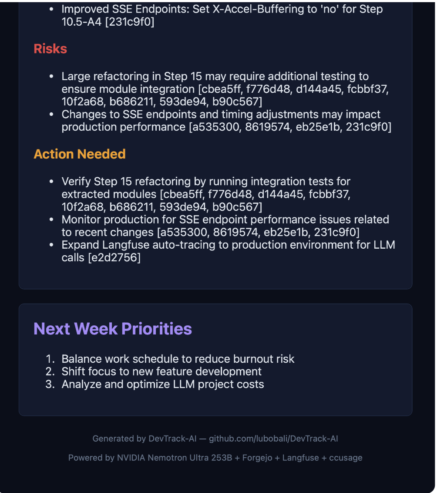

# DevTrack-AI

AI-powered engineering self-tracker. Pulls real data from your git server, LLM observability platform, and Claude Code usage logs — then generates a weekly coaching report that tells you what you did well, what to fix, and what to focus on next week.

Built for personal use by a solo developer building a production AI platform (LuBot — 635 Python files, 5,600+ tests, 6 NVIDIA models). Also serves as a homework submission for DataExpert.io AI Engineering Bootcamp (Week 2).

## Weekly Report — Real Production Email

DevTrack-AI sends a formatted weekly engineering report directly to your inbox. Here is a real report generated from live LuBot development data:



The report includes velocity scores, burnout risk assessment, wins, concerns, and specific coaching advice — all grounded in real commit data and LLM usage metrics.

## Architecture

```
DATA SOURCES                          PROCESSING                    OUTPUT
+------------------+
| Forgejo API      |---> commits
| (git.lubot.ai)   |---> issues    +-------------+
|                  |---> PRs   --->| metrics.py  |---> velocity, code health,
+------------------+               | (local math)|     RECR discipline,
                                   +-------------+     work patterns
+------------------+                      |
| Langfuse         |---> LLM traces       |        +-------------+
| (LuBot Staging)  |---> cost, latency ---+------->| NVIDIA 253B |---> Weekly Report
+------------------+                      |        | (Nemotron)  |     Issue Triage
                                          |        +-------------+     PR Summary
+------------------+                      |              |             Commit Digest
| ccusage          |---> dev costs        |              v
| (Claude Code)    |---> per-project  ----+        +-------------+
+------------------+                               | Langfuse    |
                                                   | (DevTrack)  |
                                                   +-------------+
```

## Features

### 1. Issue Triage
Feed it a GitHub/Forgejo issue — the LLM assigns severity, priority, labels, and recommended owner based on strict rubrics (not vibes).

### 2. PR Summary
Feed it a PR with diff snippets — the LLM writes a technical summary and risk checklist with citations from the actual code.

### 3. Commit Digest Email
Feed it a list of commits from a date range — the LLM drafts a stakeholder email grouped by theme (not per-commit), with risk flags and action items. Every point cites specific commit SHAs.

### 4. Weekly Engineering Report
The main feature. Pulls data from all 4 sources and generates a coaching report with real data:



- Velocity score (commits, features, refactors, fixes)
- Code health assessment (monolith sizes, dead code, module extraction)
- RECR discipline check (70% of commits include test files — detected from actual file changes, not just commit message prefixes)
- Work pattern analysis (late night commits, burnout risk)
- LLM usage insights (LuBot Staging costs, model breakdown)
- Claude Code dev costs (per-project spending from ccusage)
- Self-coaching advice (specific, actionable, anti-sycophantic)



## Data Sources

| Source | What it tracks | How |
|--------|---------------|-----|
| Forgejo API | Commits, issues, PRs, file changes per commit | REST API with token auth |
| Langfuse (LuBot) | LLM calls, tokens, cost, latency | Langfuse REST API |
| Langfuse (DevTrack) | This tool's own LLM usage | @observe decorator |
| ccusage | Claude Code dev costs per project | SSH + ccusage CLI on server |

## Safety Guardrails

1. **PII Redaction** — strips server IPs, API keys, emails, phone numbers from all data before AND after sending to the LLM
2. **Insufficient Context Fallback** — if no commits or empty issue body, the LLM flags low confidence
3. **Schema Validation** — all LLM responses parsed and validated with Pydantic v2. Retry on bad JSON.
4. **Source Citations** — every claim in the report must cite a specific commit SHA or metric

## Setup

```bash
git clone https://github.com/lubobali/DevTrack-AI.git
cd DevTrack-AI
python3.13 -m venv venv
source venv/bin/activate
pip install -r requirements.txt
cp .env.example .env
# Edit .env with your keys
```

### Required Environment Variables

```
# LLM Provider (nvidia or anthropic)
LLM_PROVIDER=nvidia
NVIDIA_API_KEY=nvapi-your-nvidia-key
NVIDIA_MODEL=nvidia/llama-3.1-nemotron-ultra-253b-v1

# Or Anthropic (alternative)
ANTHROPIC_BASE_URL=https://api.anthropic.com
ANTHROPIC_API_KEY=sk-ant-your-key
ANTHROPIC_MODEL=claude-sonnet-4-20250514

# Forgejo (git server)
FORGEJO_URL=https://your-git-server.com
FORGEJO_TOKEN=your-forgejo-api-token
FORGEJO_REPO=owner/repo

# Langfuse (DevTrack-AI own traces)
LANGFUSE_SECRET_KEY=sk-lf-your-key
LANGFUSE_PUBLIC_KEY=pk-lf-your-key
LANGFUSE_BASE_URL=https://us.cloud.langfuse.com

# Langfuse (LuBot Staging traces — optional)
LUBOT_LANGFUSE_SECRET_KEY=sk-lf-your-key
LUBOT_LANGFUSE_PUBLIC_KEY=pk-lf-your-key
LUBOT_LANGFUSE_BASE_URL=https://us.cloud.langfuse.com

# Email (Resend)
RESEND_API_KEY=re_your-key
RESEND_FROM=onboarding@resend.dev
REPORT_EMAIL=your-email@example.com
```

## OpenClaw Integration — Real-Time WhatsApp Access

DevTrack-AI can be wired to [OpenClaw](https://github.com/openclaw/openclaw) so you can query your engineering data from WhatsApp (or Telegram, Discord, etc.) in real time.

**How it works:**
1. `api.py` — FastAPI server that exposes all DevTrack metrics as REST endpoints
2. `openclaw_skill/SKILL.md` — OpenClaw skill that teaches your agent to query the API
3. You text your AI agent on WhatsApp → it curls the API → answers with real data

**Example conversation:**
```
You:    "What did I ship today?"
Alfred: "9 commits yesterday — observability blitz, Uptime Kuma, SSE fix..."

You:    "Am I burning out?"
Alfred: "Burnout risk: HIGH. 7 late-night commits, peak hour 7pm..."
```

### Start the API server
```bash
pip install fastapi uvicorn
uvicorn api:app --host 0.0.0.0 --port 8099
```

### Install the OpenClaw skill
Copy `openclaw_skill/SKILL.md` to `~/.openclaw/workspace/skills/devtrack/SKILL.md` and update `YOUR_SERVER_IP` with your server's address.

## Usage

### Run all 4 features
```bash
python -m devtrack_ai.solution
```

### Send weekly report email
```bash
python -m devtrack_ai.send_weekly_report
```

### Run tests
```bash
# All 43 tests (~2 min, includes real API calls)
python -m pytest devtrack_ai/test_solution.py -v

# Fast tests only (~1 sec, no API calls)
python -m pytest devtrack_ai/test_solution.py -v -k "Schema or PII or Context or Metrics"
```

## Folder Structure

```
DevTrack-AI/
  devtrack_ai/
    client.py              — LLM wrapper (NVIDIA NIM or Anthropic) + Langfuse
    git_client.py          — Forgejo API (commits, issues, PRs, file changes)
    langfuse_client.py     — LuBot Staging LLM usage data
    ccusage_client.py      — Claude Code dev costs via SSH
    metrics.py             — Engineering metrics (local math, zero tokens)
    schemas.py             — Pydantic v2 models for all I/O
    guardrails.py          — PII redaction (pre + post) + context check
    solution.py            — 4 features + shared pipeline + CLI
    email_sender.py        — Resend email delivery
    send_weekly_report.py  — Generate + email weekly report
    test_solution.py       — 43 tests across 11 classes
    sample_inputs/         — Real Forgejo data snapshots
    sample_outputs/        — Real LLM responses (4 files)
  claude_skills/
    issue_triage.md        — Issue triage prompt (rubrics + closed sets)
    pr_summary.md          — PR summary prompt (5 risk categories)
    commit_digest_email.md — Commit digest prompt (theme grouping)
    engineering_report.md  — Weekly coaching prompt (anti-sycophancy)
  api.py                   — FastAPI server for OpenClaw integration
  query.py                 — CLI wrapper for real-time queries
  openclaw_skill/
    SKILL.md               — OpenClaw skill definition (copy to workspace)
  Screenshots/             — Real email report screenshots
  CLAUDE.md                — AI operating context
  HANDOFF.md               — Human handoff document
  RATIONALE.md             — Documentation tradeoff note
  writeup.md               — Design note (prompt strategy + guardrails)
  pyproject.toml
  requirements.txt

```

## Tests

43 tests across 11 classes (test_output.log: "43 passed"):
- Schema validation (6 tests) — no API calls
- PII redaction (6 tests) — no API calls
- Context sufficiency (4 tests) — no API calls
- Git client (4 tests) — Forgejo API only
- Metrics calculator (6 tests) — pure math, includes RECR detection
- LLM client (1 test) — 1 API call
- Feature pipelines (7 tests) — real LLM calls (triage + PR + digest + report)
- Guardrail integration (5 tests) — end-to-end with PII output redaction
- Langfuse data pull (1 test) — Langfuse API
- ccusage data pull (1 test) — SSH to server
- Email sender (1 test) — Resend API

## Built With

- Python 3.13, Pydantic v2, pytest
- NVIDIA NIM API (Nemotron Ultra 253B) — configurable to Anthropic via .env
- Forgejo REST API
- Langfuse v4
- Resend (email delivery)
- ccusage (Claude Code usage tracker)
